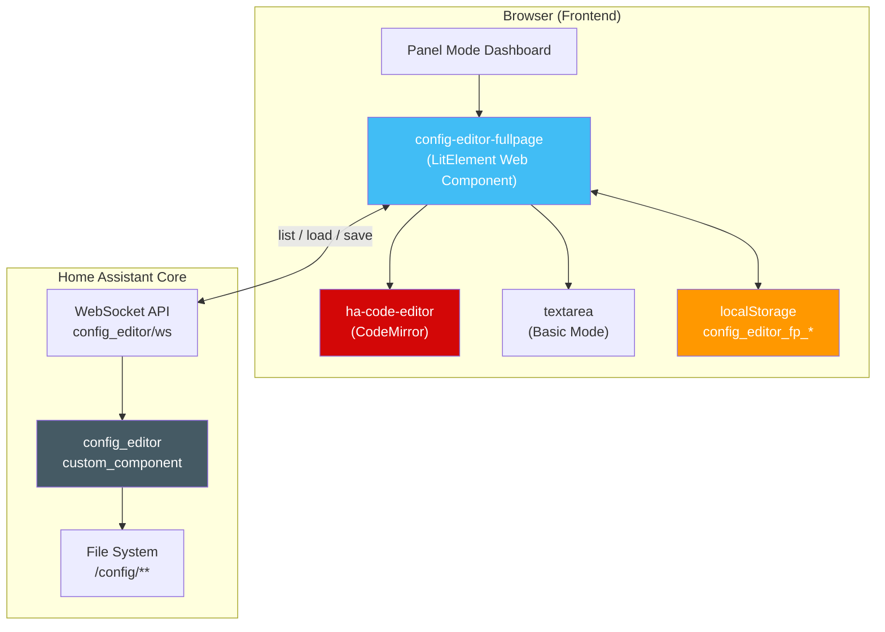
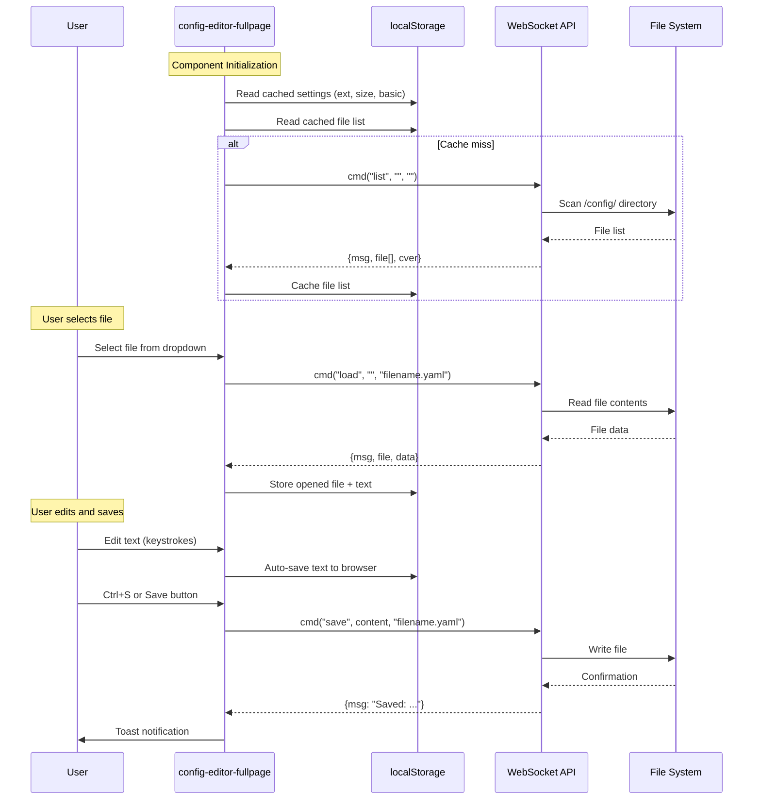
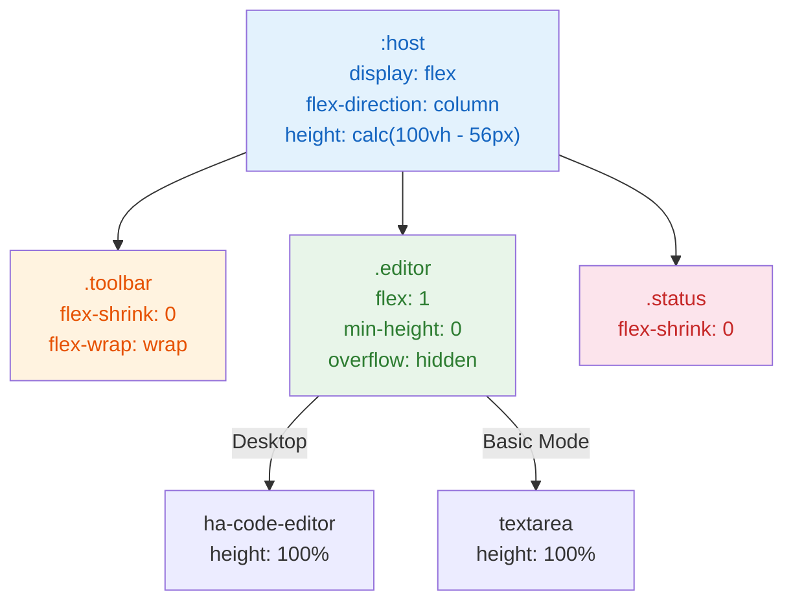

<p align="center">
  
</p>

<h1 align="center">Config Editor Fullpage</h1>

<p align="center">
  <strong>Full-page immersive YAML/config editor for Home Assistant</strong><br>
  A Lovelace custom card that fills the entire Panel Mode dashboard — no wasted space.
</p>

<p align="center">
  <a href="#features">Features</a> •
  <a href="#screenshots">Screenshots</a> •
  <a href="#architecture">Architecture</a> •
  <a href="#installation">Installation</a> •
  <a href="#configuration">Configuration</a> •
  <a href="#testing">Testing</a> •
  <a href="#license">License</a> •
  <a href="README_zh-TW.md">繁體中文</a>
</p>

<p align="center">
  
  
  
  
  
  
</p>

---

## Overview

**Config Editor Fullpage** transforms the [junkfix/config-editor](https://github.com/junkfix/config-editor) card into a full-page, immersive editing experience. Instead of a small card floating in a dashboard, the editor fills the entire available space — toolbar at the top, status bar at the bottom, and the code editor taking all remaining height.

### Why This Component?

| | Original Card | Config Editor Fullpage |
|---|---|---|
| **Layout** | Fixed `80vh` inside `<ha-card>` | `flex: 1` fills 100% available space |
| **Toolbar** | Split between top and bottom bars | Single unified toolbar at top |
| **Height** | Hardcoded, wastes space | `calc(100vh - header)` dynamic |
| **Mobile** | Basic responsive | Full RWD with `flex-wrap` breakpoints |
| **Theming** | Partial HA variable usage | Complete HA CSS variable integration |
| **Panel Mode** | Not designed for it | Built specifically for Panel Mode |
| **File Size** | Multi-file | Single file, ~13KB, zero dependencies |

---

## Features

### Core Editing
- **Full-page layout** — editor fills 100% of available viewport height
- **CodeMirror editor** — via Home Assistant's built-in `ha-code-editor` with syntax highlighting
- **Basic mode** — fallback `<textarea>` editor for lightweight editing
- **Multi-format support** — YAML, Python, JSON, Conf, JS, TXT, Log, Jinja, and all files
- **Ctrl+S / Cmd+S** — keyboard shortcut to save

### File Management
- **File browser** — dropdown selector with file listing from HA config directory
- **Configurable depth** — control subdirectory scan depth (default: 2)
- **New file creation** — save to a new path with prompt dialog
- **Extension filtering** — quickly switch between file types

### User Experience
- **Font size controls** — increase (+), decrease (−), and reset (A) with 30%-300% range
- **Unsaved change detection** — warns before switching files with unsaved edits
- **Browser recovery** — auto-saves text to `localStorage`, recoverable after page reload
- **Status bar** — shows loaded file path, save confirmations, and error alerts
- **Toast notifications** — native HA notification system integration

### Responsive Design
- **Desktop** — single-row toolbar, full-width editor
- **Mobile** — toolbar wraps to two rows, file selector goes full-width
- **Breakpoint** — `768px` with smooth `flex-wrap` transition

### Theming
- **100% HA theme compatible** — uses `--primary-background-color`, `--primary-text-color`, `--app-header-background-color`, and all standard HA CSS variables
- **Dark mode** — fully supported through HA theme variables
- **No hardcoded colors** — every color references a CSS variable with sensible fallbacks

---

## Screenshots

### Desktop — Initial View
<p align="center">
  
</p>
<p align="center"><em>Clean initial state with file browser, extension filter, and font controls</em></p>

### Desktop — File Loaded
<p align="center">
  
</p>
<p align="center"><em>Configuration.yaml loaded with syntax highlighting via CodeMirror</em></p>

### Desktop — Full Editor
<p align="center">
  
</p>
<p align="center"><em>Full-page editor filling all available space below the HA header</em></p>

### Mobile — Responsive Layout
<p align="center">
  
</p>
<p align="center"><em>Responsive toolbar wraps to multiple rows on narrow viewports</em></p>

---

## Architecture

### System Overview

```
┌─────────────────────────────────────────────────────────────┐
│                    Home Assistant Frontend                    │
│  ┌───────────────────────────────────────────────────────┐  │
│  │              Panel Mode Dashboard                      │  │
│  │  ┌─────────────────────────────────────────────────┐  │  │
│  │  │         config-editor-fullpage (LitElement)      │  │  │
│  │  │                                                   │  │  │
│  │  │  ┌─────────────────────────────────────────────┐ │  │  │
│  │  │  │ Toolbar: Save, Reload, File Select, Ext,    │ │  │  │
│  │  │  │          Font Size, Basic Toggle             │ │  │  │
│  │  │  ├─────────────────────────────────────────────┤ │  │  │
│  │  │  │                                             │ │  │  │
│  │  │  │  ha-code-editor (CodeMirror) / <textarea>   │ │  │  │
│  │  │  │            flex: 1 (fills space)            │ │  │  │
│  │  │  │                                             │ │  │  │
│  │  │  ├─────────────────────────────────────────────┤ │  │  │
│  │  │  │ Status Bar: file path, alerts, info         │ │  │  │
│  │  │  └─────────────────────────────────────────────┘ │  │  │
│  │  └──────────────────────┬──────────────────────────┘  │  │
│  └─────────────────────────┼─────────────────────────────┘  │
└────────────────────────────┼────────────────────────────────┘
                             │ WebSocket
                             ▼
┌─────────────────────────────────────────────────────────────┐
│                   Home Assistant Backend                      │
│  ┌───────────────────────────────────────────────────────┐  │
│  │  config_editor custom component (junkfix/config-editor)│  │
│  │  WebSocket API: config_editor/ws                       │  │
│  │  Actions: list | load | save                           │  │
│  └───────────────────────────────────────────────────────┘  │
│  ┌───────────────────────────────────────────────────────┐  │
│  │  /config/ directory (YAML, Python, JSON, etc.)         │  │
│  └───────────────────────────────────────────────────────┘  │
└─────────────────────────────────────────────────────────────┘
```

### Component Architecture (Mermaid)



### Data Flow (Mermaid)



### CSS Layout Strategy



---

## Installation

### Prerequisites

Install the backend component first: **[junkfix/config-editor](https://github.com/junkfix/config-editor)**

Add to your `configuration.yaml`:
```yaml
config_editor:
```

### Method 1: HACS (Recommended)

1. Open HACS → Frontend → **Custom Repositories**
2. Add this repository URL, select category **Lovelace**
3. Find and install **Config Editor Fullpage**
4. Restart Home Assistant

### Method 2: Manual Installation

1. Download `config-editor-fullpage.js` from this repository
2. Copy to `<HA config>/www/config-editor-fullpage.js`
3. Go to **Settings → Dashboards → Resources**, add:
   - URL: `/local/config-editor-fullpage.js`
   - Type: **JavaScript Module**

### Dashboard Setup

Create a **Panel Mode** dashboard with this card:

```yaml
views:
  - title: Config Editor
    panel: true
    cards:
      - type: custom:config-editor-fullpage
        depth: 3
```

---

## Configuration

### Card Options

| Option | Default | Description |
|--------|---------|-------------|
| `depth` | `2` | Subdirectory scan depth for file listing |
| `file` | — | Auto-open a specific file on load |
| `readonly` | `false` | Read-only mode (hides Save button) |
| `basic` | `false` | Force textarea editor (skip CodeMirror) |
| `size` | `100` | Initial font size percentage |

### Example Configurations

**Default — full editor with deep scan:**
```yaml
type: custom:config-editor-fullpage
depth: 3
```

**Read-only viewer for secrets:**
```yaml
type: custom:config-editor-fullpage
file: secrets.yaml
readonly: true
```

**Lightweight mode for slow devices:**
```yaml
type: custom:config-editor-fullpage
basic: true
size: 120
depth: 1
```

### Keyboard Shortcuts

| Shortcut | Action |
|----------|--------|
| `Ctrl+S` / `Cmd+S` | Save current file |

### Extension Filters

| Filter | File Types |
|--------|------------|
| YAML | `.yaml` files |
| PY | `.py` Python files |
| JSON | `.json` files |
| CONF | `.conf` configuration files |
| JS | `.js` JavaScript files |
| TXT | `.txt` text files |
| LOG | `.log` log files |
| JINJA | `.jinja` template files |
| ALL | All files regardless of extension |

---

## Testing

This component has been enterprise-grade tested with **56 automated test cases** across **9 testing rounds** using Playwright:

| Round | Category | Tests | Status |
|-------|----------|-------|--------|
| 1 | Stress Testing | 7 | PASS |
| 2 | Edge Cases | 8 | PASS |
| 3 | State Persistence | 7 | PASS |
| 4 | Network Resilience | 7 | PASS |
| 5 | Viewport & RWD | 8 | PASS |
| 6 | Memory & Performance | 6 | PASS |
| 7 | Security (XSS/Injection) | 6 | PASS |
| 8 | Concurrency & Race Conditions | 7 | PASS |
| 9 | Regression Suite | 8 | PASS |

**Key metrics:**
- Zero DOM leaks after 100 file switches
- ~23MB heap usage under stress
- ~0.01ms average render time
- 10 XSS attack vectors blocked
- No prototype pollution vulnerabilities
- Survives 10 simultaneous WebSocket calls
- Triple-click save button — no crash

Test scripts are available in the `.playwright-cli/` directory.

---

## File Structure

```
Woow_ha_config_component/
├── config-editor-fullpage.js     # Main component (single file, ~13KB)
├── hacs.json                      # HACS frontend descriptor
├── README.md                      # English documentation
├── README_zh-TW.md                # 繁體中文文件
├── .gitignore
├── docs/
│   ├── screenshots/               # Documentation screenshots
│   │   ├── 01-initial-view.png
│   │   ├── 02-file-loaded.png
│   │   ├── 03-desktop-editor.png
│   │   └── 04-mobile-responsive.png
│   └── plans/
│       └── 2026-05-05-ha-config-editor-fullpage-design.md
├── .playwright-cli/               # Automated test scripts
│   ├── round1-stress.js
│   ├── round2-edge.js
│   ├── round3-persist.js          # + round3b, round3c variants
│   ├── round4-network.js
│   ├── round5-viewport.js
│   ├── round6-memory.js
│   ├── round7-security.js
│   ├── round8-concurrent.js
│   └── round9-regression.js       # + round9b, round9c variants
└── test-ha/                       # Local test environment
    ├── docker-compose.yml         # Podman/Docker HA setup
    └── config/
        ├── configuration.yaml
        ├── custom_components/
        │   └── config_editor/     # Backend component (junkfix)
        └── www/
            └── config-editor-fullpage.js
```

---

## Dependencies

| Dependency | Type | Source |
|------------|------|--------|
| Home Assistant | Platform | Required (2024.x+) |
| [config-editor](https://github.com/junkfix/config-editor) | Backend | Custom component (WebSocket API) |
| LitElement | Runtime | Provided by HA frontend |
| ha-code-editor | Runtime | Provided by HA frontend (CodeMirror) |

**Zero external npm dependencies.** Single JavaScript file, no build step required.

---

## Credits

- **Backend**: [junkfix/config-editor](https://github.com/junkfix/config-editor) — WebSocket API for file operations
- **Original card**: [junkfix/config-editor-card](https://github.com/junkfix/config-editor-card) — inspiration and base logic
- **Developed by**: [WOOWTECH](https://github.com/WOOWTECH)

---

## License

MIT License — see [LICENSE](LICENSE) for details.

Based on [junkfix/config-editor-card](https://github.com/junkfix/config-editor-card).
