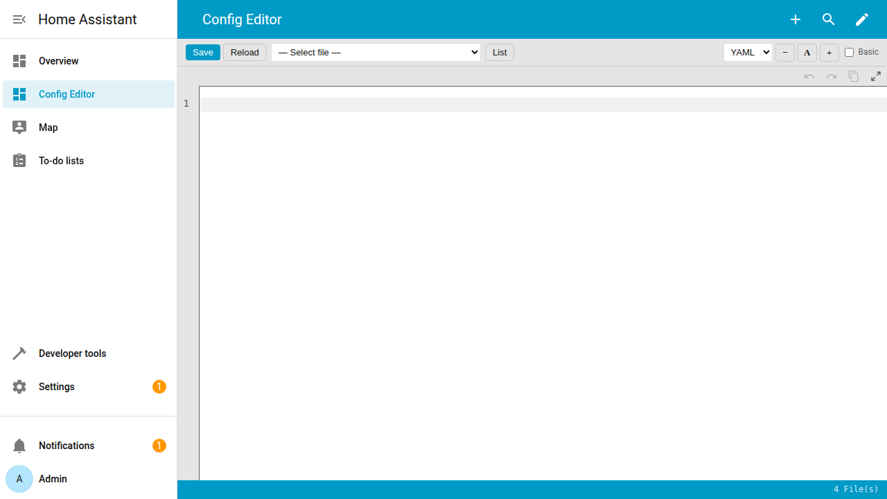
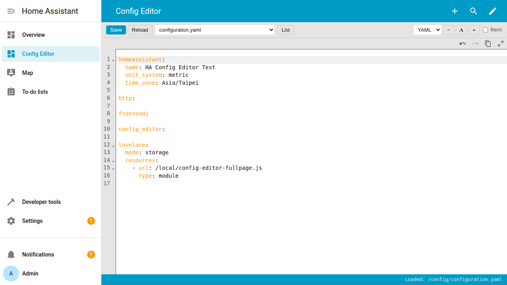
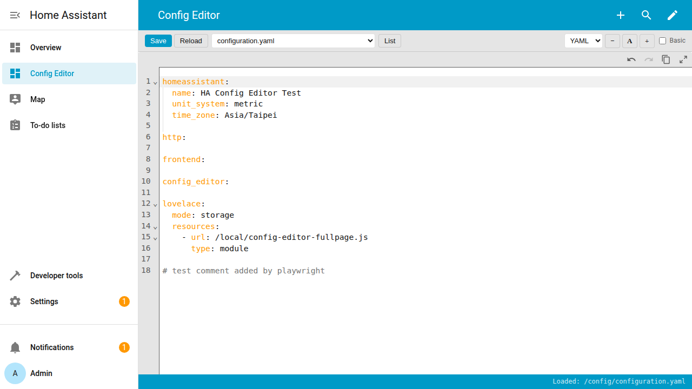
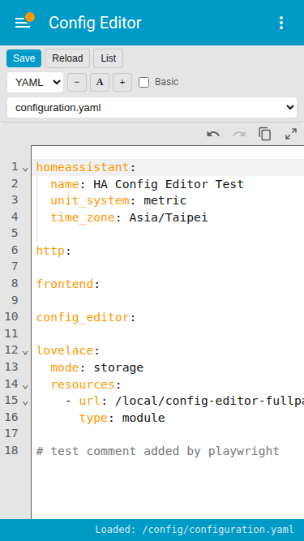
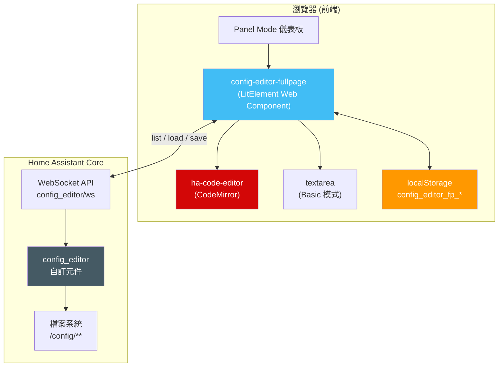
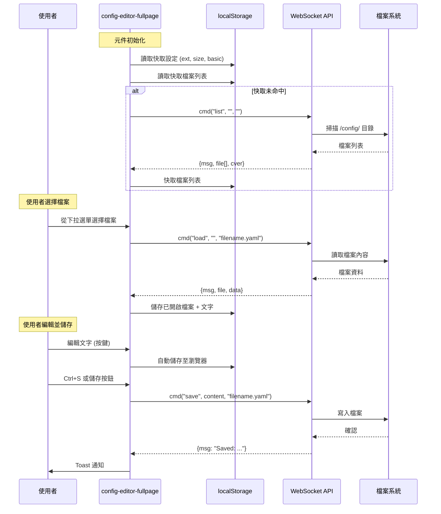
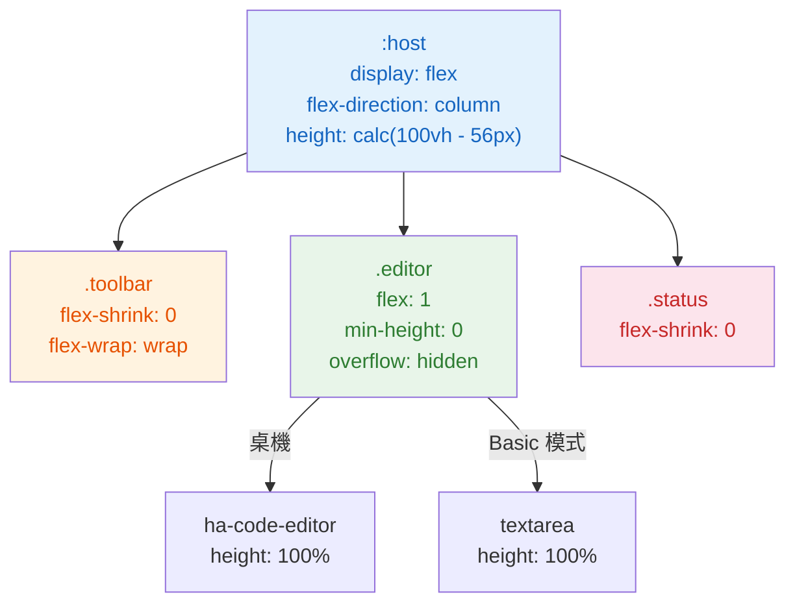

<p align="center">
  
</p>

<h1 align="center">Config Editor Fullpage</h1>

<p align="center">
  <strong>Home Assistant 全頁沉浸式 YAML/設定檔編輯器</strong><br>
  Lovelace 自訂卡片，填滿整個 Panel Mode 儀表板 — 不浪費任何空間。
</p>

<p align="center">
  <a href="#功能特色">功能特色</a> •
  <a href="#畫面截圖">畫面截圖</a> •
  <a href="#系統架構">系統架構</a> •
  <a href="#安裝方式">安裝方式</a> •
  <a href="#設定選項">設定選項</a> •
  <a href="#測試報告">測試報告</a> •
  <a href="#授權">授權</a> •
  <a href="README.md">English</a>
</p>

<p align="center">
  
  
  
  
  
  
</p>

---

## 概述

**Config Editor Fullpage** 將 [junkfix/config-editor](https://github.com/junkfix/config-editor) 卡片改造為全頁沉浸式編輯體驗。編輯器不再是儀表板中的一個小卡片，而是填滿整個可用空間 — 頂部工具列、底部狀態列、編輯區佔滿所有剩餘高度。

### 為什麼選擇這個元件？

| | 原始卡片 | Config Editor Fullpage |
|---|---|---|
| **佈局** | 固定 `80vh` 在 `<ha-card>` 內 | `flex: 1` 填滿 100% 可用空間 |
| **工具列** | 分散在頂部和底部 | 統一合併至頂部 |
| **高度** | 寫死數值，浪費空間 | `calc(100vh - header)` 動態計算 |
| **手機** | 基本響應式 | 完整 RWD，`flex-wrap` 斷點 |
| **主題** | 部分 HA 變數使用 | 完整 HA CSS 變數整合 |
| **Panel Mode** | 非專為此設計 | 專為 Panel Mode 打造 |
| **檔案大小** | 多檔案 | 單一檔案，~13KB，零依賴 |

---

## 功能特色

### 核心編輯
- **全頁佈局** — 編輯區填滿 100% 可用視窗高度
- **CodeMirror 編輯器** — 透過 HA 內建 `ha-code-editor`，支援語法高亮
- **Basic 模式** — 備用 `<textarea>` 編輯器，適用於輕量編輯
- **多格式支援** — YAML、Python、JSON、Conf、JS、TXT、Log、Jinja 及所有檔案
- **Ctrl+S / Cmd+S** — 鍵盤快捷鍵儲存

### 檔案管理
- **檔案瀏覽器** — 下拉選單列出 HA 設定目錄中的檔案
- **可設定深度** — 控制子資料夾掃描深度（預設：2）
- **建立新檔** — 透過對話框輸入路徑儲存新檔案
- **副檔名過濾** — 快速切換不同檔案類型

### 使用者體驗
- **字體大小控制** — 放大 (+)、縮小 (−)、重置 (A)，範圍 30%-300%
- **未儲存變更偵測** — 切換檔案前提示未儲存的修改
- **瀏覽器復原** — 自動儲存文字至 `localStorage`，頁面重整後可恢復
- **狀態列** — 顯示載入的檔案路徑、儲存確認及錯誤警告
- **Toast 通知** — 整合 HA 原生通知系統

### 響應式設計
- **桌機** — 單行工具列，全寬編輯器
- **手機** — 工具列自動換行，檔案選單佔滿全寬
- **斷點** — `768px`，`flex-wrap` 平滑過渡

### 主題相容
- **100% HA 主題相容** — 使用 `--primary-background-color`、`--primary-text-color`、`--app-header-background-color` 等全部標準 HA CSS 變數
- **深色模式** — 透過 HA 主題變數完整支援
- **無寫死顏色** — 每個顏色都引用 CSS 變數，並附帶合理的預設值

---

## 畫面截圖

### 桌機 — 初始畫面
<p align="center">
  
</p>
<p align="center"><em>乾淨的初始狀態，包含檔案瀏覽器、副檔名過濾器及字體控制</em></p>

### 桌機 — 載入檔案
<p align="center">
  
</p>
<p align="center"><em>透過 CodeMirror 載入 configuration.yaml 並顯示語法高亮</em></p>

### 桌機 — 完整編輯器
<p align="center">
  
</p>
<p align="center"><em>全頁編輯器填滿 HA 標頭下方所有可用空間</em></p>

### 手機 — 響應式佈局
<p align="center">
  
</p>
<p align="center"><em>工具列在窄視窗下自動換行為多列</em></p>

---

## 系統架構

### 系統總覽

```
┌─────────────────────────────────────────────────────────────┐
│                    Home Assistant 前端                        │
│  ┌───────────────────────────────────────────────────────┐  │
│  │              Panel Mode 儀表板                         │  │
│  │  ┌─────────────────────────────────────────────────┐  │  │
│  │  │         config-editor-fullpage (LitElement)      │  │  │
│  │  │                                                   │  │  │
│  │  │  ┌─────────────────────────────────────────────┐ │  │  │
│  │  │  │ 工具列: 儲存、重載、檔案選單、副檔名、       │ │  │  │
│  │  │  │          字體大小、Basic 切換                 │ │  │  │
│  │  │  ├─────────────────────────────────────────────┤ │  │  │
│  │  │  │                                             │ │  │  │
│  │  │  │  ha-code-editor (CodeMirror) / <textarea>   │ │  │  │
│  │  │  │            flex: 1 (填滿空間)                │ │  │  │
│  │  │  │                                             │ │  │  │
│  │  │  ├─────────────────────────────────────────────┤ │  │  │
│  │  │  │ 狀態列: 檔案路徑、警告、資訊                 │ │  │  │
│  │  │  └─────────────────────────────────────────────┘ │  │  │
│  │  └──────────────────────┬──────────────────────────┘  │  │
│  └─────────────────────────┼─────────────────────────────┘  │
└────────────────────────────┼────────────────────────────────┘
                             │ WebSocket
                             ▼
┌─────────────────────────────────────────────────────────────┐
│                   Home Assistant 後端                         │
│  ┌───────────────────────────────────────────────────────┐  │
│  │  config_editor 自訂元件 (junkfix/config-editor)        │  │
│  │  WebSocket API: config_editor/ws                       │  │
│  │  動作: list | load | save                              │  │
│  └───────────────────────────────────────────────────────┘  │
│  ┌───────────────────────────────────────────────────────┐  │
│  │  /config/ 目錄 (YAML, Python, JSON 等)                 │  │
│  └───────────────────────────────────────────────────────┘  │
└─────────────────────────────────────────────────────────────┘
```

### 元件架構 (Mermaid)



### 資料流程 (Mermaid)



### CSS 佈局策略



---

## 安裝方式

### 前置需求

首先安裝後端元件：**[junkfix/config-editor](https://github.com/junkfix/config-editor)**

在 `configuration.yaml` 中加入：
```yaml
config_editor:
```

### 方法一：HACS（推薦）

1. 開啟 HACS → Frontend → **自訂存儲庫**
2. 貼上本存儲庫 URL，類別選 **Lovelace**
3. 搜尋並安裝 **Config Editor Fullpage**
4. 重新啟動 Home Assistant

### 方法二：手動安裝

1. 從本存儲庫下載 `config-editor-fullpage.js`
2. 複製到 `<HA config>/www/config-editor-fullpage.js`
3. 前往 **設定 → 儀表板 → 資源**，新增：
   - URL：`/local/config-editor-fullpage.js`
   - 類型：**JavaScript Module**

### 儀表板設定

建立一個 **Panel Mode** 儀表板，加入此卡片：

```yaml
views:
  - title: Config Editor
    panel: true
    cards:
      - type: custom:config-editor-fullpage
        depth: 3
```

---

## 設定選項

### 卡片參數

| 選項 | 預設值 | 說明 |
|------|--------|------|
| `depth` | `2` | 子資料夾掃描深度 |
| `file` | — | 載入時自動開啟指定檔案 |
| `readonly` | `false` | 唯讀模式（隱藏儲存按鈕） |
| `basic` | `false` | 強制使用 textarea 編輯器（跳過 CodeMirror） |
| `size` | `100` | 初始字體大小百分比 |

### 設定範例

**預設 — 完整編輯器，深層掃描：**
```yaml
type: custom:config-editor-fullpage
depth: 3
```

**唯讀模式檢視 secrets：**
```yaml
type: custom:config-editor-fullpage
file: secrets.yaml
readonly: true
```

**輕量模式，適用於慢速裝置：**
```yaml
type: custom:config-editor-fullpage
basic: true
size: 120
depth: 1
```

### 鍵盤快捷鍵

| 快捷鍵 | 動作 |
|--------|------|
| `Ctrl+S` / `Cmd+S` | 儲存目前檔案 |

### 副檔名過濾

| 過濾器 | 檔案類型 |
|--------|----------|
| YAML | `.yaml` 檔案 |
| PY | `.py` Python 檔案 |
| JSON | `.json` 檔案 |
| CONF | `.conf` 設定檔 |
| JS | `.js` JavaScript 檔案 |
| TXT | `.txt` 純文字檔 |
| LOG | `.log` 日誌檔 |
| JINJA | `.jinja` 模板檔 |
| ALL | 所有檔案（不限副檔名） |

---

## 測試報告

本元件已通過企業級 **56 個自動化測試案例**，涵蓋 **9 輪測試**，使用 Playwright 執行：

| 輪次 | 類別 | 測試數 | 狀態 |
|------|------|--------|------|
| 1 | 壓力測試 | 7 | 通過 |
| 2 | 邊界案例 | 8 | 通過 |
| 3 | 狀態持久化 | 7 | 通過 |
| 4 | 網路韌性 | 7 | 通過 |
| 5 | 視窗與 RWD | 8 | 通過 |
| 6 | 記憶體與效能 | 6 | 通過 |
| 7 | 安全性 (XSS/注入) | 6 | 通過 |
| 8 | 併發與競態條件 | 7 | 通過 |
| 9 | 回歸測試 | 8 | 通過 |

**關鍵指標：**
- 100 次檔案切換後零 DOM 洩漏
- 壓力測試下 ~23MB 記憶體使用量
- ~0.01ms 平均渲染時間
- 阻擋 10 種 XSS 攻擊向量
- 無原型鏈污染漏洞
- 承受 10 個同時 WebSocket 呼叫
- 三連點擊儲存按鈕 — 不會當機

測試腳本位於 `.playwright-cli/` 目錄。

---

## 檔案結構

```
Woow_ha_config_component/
├── config-editor-fullpage.js     # 主要元件（單一檔案，~13KB）
├── hacs.json                      # HACS 前端元件描述
├── README.md                      # 英文文件
├── README_zh-TW.md                # 繁體中文文件
├── .gitignore
├── docs/
│   ├── screenshots/               # 文件截圖
│   │   ├── 01-initial-view.png
│   │   ├── 02-file-loaded.png
│   │   ├── 03-desktop-editor.png
│   │   └── 04-mobile-responsive.png
│   └── plans/
│       └── 2026-05-05-ha-config-editor-fullpage-design.md
├── .playwright-cli/               # 自動化測試腳本
│   ├── round1-stress.js
│   ├── round2-edge.js
│   ├── round3-persist.js
│   ├── round4-network.js
│   ├── round5-viewport.js
│   ├── round6-memory.js
│   ├── round7-security.js
│   ├── round8-concurrent.js
│   └── round9-regression.js
└── test-ha/                       # 本地測試環境
    ├── docker-compose.yml         # Podman/Docker HA 設定
    └── config/
        ├── configuration.yaml
        ├── custom_components/
        │   └── config_editor/     # 後端元件 (junkfix)
        └── www/
            └── config-editor-fullpage.js
```

---

## 依賴

| 依賴 | 類型 | 來源 |
|------|------|------|
| Home Assistant | 平台 | 必須 (2024.x+) |
| [config-editor](https://github.com/junkfix/config-editor) | 後端 | 自訂元件 (WebSocket API) |
| LitElement | 執行時 | HA 前端內建 |
| ha-code-editor | 執行時 | HA 前端內建 (CodeMirror) |

**零外部 npm 依賴。** 單一 JavaScript 檔案，無需建構步驟。

---

## 致謝

- **後端**：[junkfix/config-editor](https://github.com/junkfix/config-editor) — 檔案操作 WebSocket API
- **原始卡片**：[junkfix/config-editor-card](https://github.com/junkfix/config-editor-card) — 靈感來源與基礎邏輯
- **開發者**：[WOOWTECH](https://github.com/WOOWTECH)

---

## 授權

MIT 授權條款 — 詳見 [LICENSE](LICENSE)。

基於 [junkfix/config-editor-card](https://github.com/junkfix/config-editor-card) 改作。
